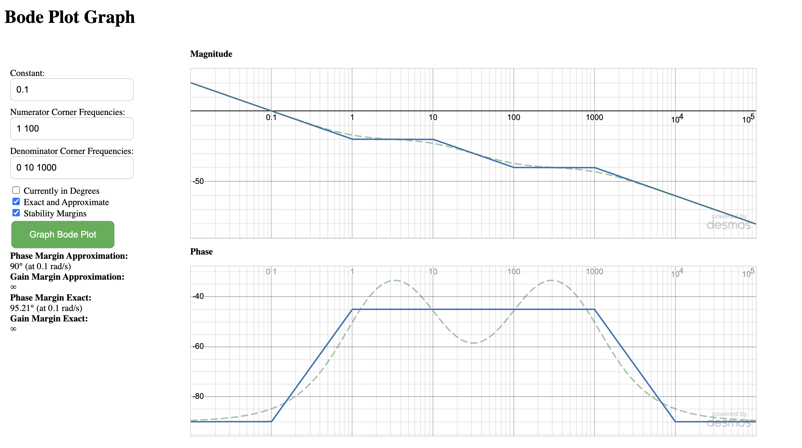

# Bode Plot
## Overview
This web application allows users to input transfer functions, compute their frequency responses, and visualize both magnitude (in dB) and phase (in degrees) plots using Desmos.

## Usage
1. The website is deployed here: [Bode Plot](https://yk9221.github.io/Bode-Plot/)
2. Input the constant, then the corner frequencies in the numerator and denominator
3. Press Enter or click on the button to draw
4. This will output the magnitude (in dB) and phase plots along with the gain and phase margins
5. The blue solid line represents the approximated Bode plot, while the green dotted line shows the actual Bode plot

## Example

This is an example of the Bode plot:

$$
L(s) = 0.1 \cdot \frac{(1 + s)\left(1 + \frac{s}{100}\right)}{s \left(1 + \frac{s}{10}\right)\left(1 + \frac{s}{1000}\right)}
$$

The input would thus be
- Constant: 0.1
- Numerator: 1 100
- Denominator: 0 10 1000